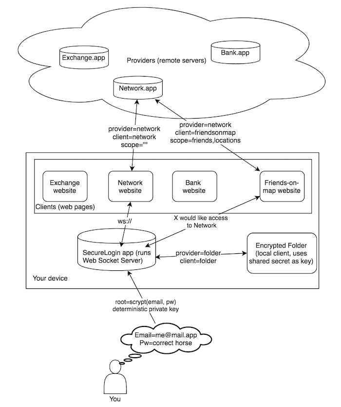

SecureLogin
-------

**Introduction**

This is a Draft RFC Specification for SecureLogin, an authentication protocol created by
Sakurity. The development of this protocol started
in 2014. 

THIS SOFTWARE IS PROVIDED BY THE COPYRIGHT HOLDERS AND CONTRIBUTORS "AS IS" AND
ANY EXPRESS OR IMPLIED WARRANTIES, INCLUDING, BUT NOT LIMITED TO, THE IMPLIED
WARRANTIES OF MERCHANTABILITY AND FITNESS FOR A PARTICULAR PURPOSE ARE
DISCLAIMED. IN NO EVENT SHALL THE COPYRIGHT HOLDER OR CONTRIBUTORS BE LIABLE FOR
ANY DIRECT, INDIRECT, INCIDENTAL, SPECIAL, EXEMPLARY, OR CONSEQUENTIAL DAMAGES
(INCLUDING, BUT NOT LIMITED TO, PROCUREMENT OF SUBSTITUTE GOODS OR SERVICES;
LOSS OF USE, DATA, OR PROFITS; OR BUSINESS INTERRUPTION) HOWEVER CAUSED AND ON
ANY THEORY OF LIABILITY, WHETHER IN CONTRACT, STRICT LIABILITY, OR TORT
(INCLUDING NEGLIGENCE OR OTHERWISE) ARISING IN ANY WAY OUT OF THE USE OF THIS
SOFTWARE, EVEN IF ADVISED OF THE POSSIBILITY OF SUCH DAMAGE.

# Overview

SecureLogin is a protocol designed to authenticate users to remote servers and local applications using a SecureLogin client application.

Unlike password managers, SecureLogin is not something you can use with any application right now, but instead a protocol to interact with servers that have
implemented this specification.

SecureLogin has a number of design principles:

 * **Decentralized**: at no point in this protocol there's a central authority. No entity can log into account but the user. No servers store any sensitive information or require the user to backup key material. Creating valid signed `sltoken` with SecureLogin app is one and the only way to get into account. There must be no "recovery" options or trusted 3rd party services.

 * **Scalability**: most existings user devices such as smartphones, laptops and desktop computers must be supported without any additional hardware. There's also no requirement to OS, browser or hardware specs.

 * **Convenient**: login experience must be smooth and take only 2 clicks once the app is up and running.



# Terminology

Let's define a few terms we will be using throughout this document:

* provider: who you're authenticating for, origin of the app. 

* client: who you're authenticating with. Normally equal to provider, which means the client side of https://my.app is authenticating to https://my.app server side. The client may also set a different `provider` eg `https://SocialNetwork.app` and **authorize** specific `scope`, eg `access=Friends list`. When provider is different from client, we call it a Connect request - our own stateless OAuth replacement.

* scope: what are you allowed to do. By default scope is empty string for regular sign-in/sign-up flow most websites use which looks like this:

```
provider=https://my.app
client=https://my.app
scope=(empty string)
```

* expire_at: to prevent replay attacks all sltokens have an expire_at set as current_time + 60 seconds but the clients may ignore it or allow much longer expiration time.

* flow: what kind of SecureLogin client the user has. Can be a `web` for `https://securelogin.pw`, or `ext` Chrome Extension or `app` for the native app. 

* sltoken: short value which is nested csv (comma-separated values). We don't use JSON for a few reasons: 1) there are no changes expected to the format so there's no need for overhead in explicit hash keys 2) JSON is unordered and we do need order for signing provider, client, scope and expire_at altogether.

* profile: please note word "account" shouldn't be used because account is something stored in a database record but profiles are ephemeral and can be generated from email + pw any time. SecureLogin Profiles are used to create accounts on websites. Profiles have this structure:

```
{
  checksum: 'zl', # the client stores first two chars of `nacl.hash(pw)` for doublecheck
  date: "2017-06-28T08:52:14.984Z", # when profile was derived
  email: "my@email.com", # Email used as salt and also sent to websites as advisory contact address
  root: "5rMbnCAdi3xBbUUZAmTKmatmyL7rCIb+slK4ZGfxtV1=" # everything is derived from the root which is result of scrypt(pw, email),
  visited: ['https://cobased.com'] # an array of visited origins. Used in Change Password functionality
}
```

* doublecheck: is used to make sure the user did not forget master password. On 2, 4, 8, 16th account created with SecureLogin the client must require the user to type master password again. If they fail, the client offers to use Change Password

* doublesign: a feature planned for 2.0 when a user can have two different master passwords for mobile and desktop and authorize critical actions on both devices using either a centralized encrypted broker, QR codes or Bluetooth.

* connect: OAuth replacement, when SecureLogin is used to authorize scope for 3rd party clients.

# Client implementation

SecureLogin clients can come in many flavours: there are web based such as `https://securelogin.pw` official Web client and [Chrome Extension](https://chrome.google.com/webstore/developer/edit/abpigncghjblhknbbannlhmgjpjpbajj) and there are native apps written in Rust or JS + Electron.

There are a lot of corner cases so please look [into reference implementation in JS](https://github.com/sakurity/securelogin) for details. 

## About sltoken

sltoken is the core of SecureLogin Protocol. It's easy to pack and unpack and has following format:

csv( csv(provider, client, scope, expire_at), csv(publicKey, sharedSecret), csv(signature, hmac_signature), email )

csv helper must only escape % and , to ensure integrity of data:

```
csv = function (str) {
  if (str instanceof Array) {
    return str.map(function (el) {
      return el.toString().replace(/[%,]/g, function (f) {
        return f === '%' ? '%25' : '%2C'
      })
    }).join(',')
  } else {
    return str.split(',').map(function (el) {
      return el.replace(/(%25|%2C)/g, function (f) {
        return f === '%25' ? '%' : ','
      })
    })
  }
}
```

Here is how sltoken is generated in our reference implementation in JavaScript:

```
function approve (profile, provider, client, scope) {
  var sharedSecret = hmac(profile.shared_base, 'secret:' + provider)
  var toSign = csv([provider, client, scope, secondsFromNow(60)])
  // Email and sharedSecret are shared only on login requests
  var isLogin = (scope === '' && provider === client)
  return csv([
    toSign,
    csv([sign(toSign, Benc(profile.shared_key.secretKey)), hmac(sharedSecret, toSign)]),
    csv([Benc(profile.shared_key.publicKey), isLogin ? sharedSecret : '']),
    isLogin ? profile.email : '' 
  ])
}
```

First goes the string to sign and interprets as: on what service (provider) the user is allowing specific app (client) do these actions (scope) until it expires (expire_at).

Here are 3 major use cases sltoken covers:

1) Sign in / Sign up requests. 

If given publicKey doesn't exist in the database, the service uses advised email, pubkey and sharedSecret provided to create a new account. Then existing or newly created record is used to verify sltoken.

Empty scope means a login request, i.e. it can be exchanged for a bearer session cookie that will be later used by the browser to do subsequent requests without need to authorize each of them __except critical actions__

2) Critical actions authorization and DoubleSign.

Some important actions should be authorized explicitly so the malware (XSS, MitM, malicious browser extensions) won't be able to do it on behalf of the user: scope="action=money transfer&amount=100" must receive it's own sltoken. Email and sharedSecret are omitted.

3) Connect (OAuth replacement)

SecureLogin-enabled users have out-of-the-box way to approve arbitrary scopes for 3rd party clients. Email and sharedSecret are omitted.

```
provider=https://socialnetwork.app
client=https://my.app
scope=Access%3Dfriends
```

Once my.app gets an sltoken with these values, it can try to make a request to `https://SocialNetwork.app/api/get_friends`, which will find the user with given pubkey, verify that scope inclides `friends`, make sure given client is whitelisted or not blacklisted (optional) then return the list of friends to requesting party my.app.

These 3 use cases will be becoming useful one by one: first we need to get a lot of websites using sltoken for Registration/Login, and provide them with secure passwords/2FA replacement. 

Then, with more financial and critical services integrating the protocol, they will be using critical action authorizations for money transfers. DoubleSign will also be added in 2.0: users will be able to approve critical actions from Mobile + Desktop devices to stop malware trying to do a critical action from a compromised device.

After a long while when SL has critical user mass providers can switch from OAuth to stateless SecureLogin Connect.


# Cryptography

SL uses solid cryptography from libraries with proven track record:

* Deterministic derivation of root hash from user's email and password. Currently only Weak-2017 scheme is offered: [scrypt](https://en.wikipedia.org/wiki/Scrypt) with logN of 18 and parallelization 6. It takes up to 20 seconds on most devices. 

```js
root = require("scrypt").hashSync("masterpassword",{
"N":Math.pow(2,18),"r":8,"p":6
},32,"user@email.com").toString("base64")
```

* For signing `provider,client,scope,expire_at` payload we use Ed25519 from [NaCl](https://nacl.cr.yp.to/sign.html)

* For all HMAC operations we use HMAC-SHA-512-256 (the first 256 bits of HMAC-SHA-512) from NaCl. HMAC is used to get shared_base from root hash: `hmac(root, 'shared')` which is used to derive everything else: `hmac(shared_base, 'secret:https://my.app')` for sharedSecret. sharedSecret exists for security-in-depth, and by default `hmac_signature` is not verified by websites.

# How to integrate SecureLogin

If your app needs some seed or entropy, you can ask SecureLogin to provide it. This way all secrets in all apps will be backed up at all times by default because they're derived from SL root hash. SL root intends to be single source of entropy for all local apps and websites, to represent user's digital identity.

## For Websites

To get started use our JS helper 

```
<script src="https://securelogin.pw/sdk.js"></script>
```

To get signed `sltoken` the app must invoke `SecureLogin(callback, scope)` on clicking login button:

```
loginbutton.onclick = function(){
  SecureLogin(function(sltoken){
    xhr('/login',{
      sltoken: sltoken,
      authenticity_token: csrf
    }, function(d){
      if(d == 'ok'){
        location.reload()
      }else{
        console.log(d)
      }
    })
  })
  return false;
}
```

The resulting sltoken is sent to server side for verification and login:

```
https://cobased.com%2Chttps://cobased.com%2C%2C1498731060,
E5faDp1F3F4AGN2z5NgwZ/e0WB+ukZO3eMRWvTTZc4erts8mMzSy+CxGdz3OW1Xff8p6m
DAPfnSK0QqSAAHmAA==%2CcIZjUTqMWYgzYGrsYEHptNiaaLapWiqgPPsG1PI/Rsw=,
kdbjcc08YBKWdCY56lQJIi92wcGOW+KcMvbSgHN6WbU=%2C1OVh/+xHRCaebQ9Lz6k
OTkTRrVm1xgvxGthABCwCQ8k=,homakov@gmail.com
```

To unpack and verify sltoken use this reference implementation in Ruby:

```
class SecureLogin
  def self.csv(str)
    str.to_s.split(',').map{|f| URI.decode(f) }
  end

  def self.hmac(secret, message)
    # HMAC-SHA-512-256 (first 256 bits) https://nacl.cr.yp.to/auth.html    
    Base64.encode64(OpenSSL::HMAC.digest(OpenSSL::Digest.new('sha512'), Base64.decode64(secret), message).slice(0,32)).strip
  end

  def self.verify(sltoken, opts={})
    message, signatures, authkeys, email = csv(sltoken)

    signature, hmac_signature = csv(signatures)
    pubkey, secret = csv(authkeys)
    #if not set, use pubkey provided inside sltoken

    pubkey = opts[:pubkey] || pubkey
    secret = opts[:secret] || secret
    origins = opts[:origins]

    # You don't have to implement shared secret verification, it's extra check for the future if public crypto fails 
    #error = "Invalid HMAC #{hmac_signature}" if self.hmac(secret, message) != hmac_signature
    RbNaCl::VerifyKey.new(Base64.decode64(pubkey)).verify(Base64.decode64(signature), message) rescue error = 'Invalid signature' 

    provider, client, scope, expire_at = csv(message)

    scope = Rack::Utils.parse_query(scope)

    error = "Invalid provider" unless origins.include? provider

    # for Connect client verification is skipped
    error = "Invalid client" unless origins.include?(client) && !opts[:connect] 
    
    # we don't mind old tokens
    error = "Expired token" unless expire_at.to_i + 86400 > Time.now.to_i 
    
    if opts[:change] == true
      # "to" is new sltoken to change to
      error = "Not mode=change token" unless scope["mode"] == 'change' && scope["to"] && scope.size == 2
    else
      error = "Invalid scope" unless scope == (opts[:scope] || {})
    end

    if error
      return {error: error}
    else
      return {
        provider: provider,
        client: client,
        scope: scope,
        expire_at: expire_at,
        email: email,
        securelogin_pubkey: pubkey,
        securelogin_secret: secret
      }
    end
  end
end
```

Your login and password change actions must look like this:

```
ORIGINS = %w{https://cobased.com http://128.199.242.161:8020 http://c.dev}

def login
  obj = SecureLogin.verify(params[:sltoken], origins: ORIGINS)
  if obj[:error]
    html obj[:error]
  else
    record = User.find_by(securelogin_pubkey: obj[:securelogin_pubkey]) || User.create({
      email: obj[:email],
      securelogin_secret: obj[:securelogin_secret],
      securelogin_pubkey: obj[:securelogin_pubkey]
    })

    session[:user_id] = record.id
    html "ok"
  end
end

# GET /securelogin - required for instant password change
def securelogin
  response.headers['Access-Control-Allow-Origin'] = '*'
  obj = SecureLogin.verify(params[:sltoken], {
    origins: ORIGINS,
    change: true
  })
  if obj[:error]
    html obj[:error]  
  elsif @user = User.find_by(securelogin_pubkey: obj[:securelogin_pubkey])
    new_obj = SecureLogin.verify(obj[:scope]["to"], origins: ORIGINS)
    if new_obj[:error]
      html "invalid_new_token:#{new_obj[:error]}" #new token is invalid
    elsif User.exists?(securelogin_pubkey: new_obj[:securelogin_pubkey])
      html "pubkey_exists"
    else
      @user.update_attributes({
        securelogin_pubkey: new_obj[:securelogin_pubkey], 
        securelogin_secret: new_obj[:securelogin_secret],
        email: new_obj[:email]
      })
      # mark new email as unconfirmed
      html "changed"
    end
  else
    html "not_found"
  end
end
```

**Warning about Email verification**: the protocol does not confirm user email and does not intend to do so. In our vision an email provided is merely an address for mails, not a primary key / identifier like in the classic authentication scheme. I.e. two accounts can have equal email.

We don't recommend to confirm / verify it at all and let user specify whatever they want **unless you are obligated by law to require explicit email confirmation**

